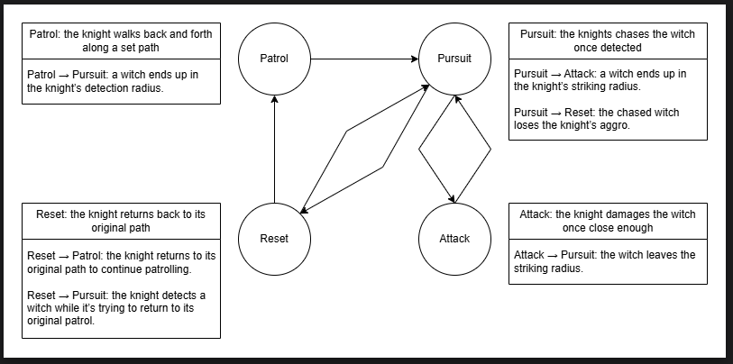

# CISC486-Group-7

## FSM Diagram

## State Descriptions
- **Patrol (Green):** The enemy follows a set path between two patrol points.
- **Pursuit (Red):** When the player enters the detection radius, the enemy chases the player.  
- **Attack (Black):** When close enough to the player, the enemy stops and attacks.  
- **Reset (Blue):** If the player escapes the detection radius, the enemy returns to its patrol path.

## Transitions
- Patrol → Pursuit: a witch ends up in the knight’s detection radius. 
- Pursuit → Attack: a witch ends up in the knight’s striking radius. 
- Pursuit → Reset: the chased witch loses the knight’s aggro. 
- Attack → Pursuit: the witch leaves the striking radius. 
- Reset → Patrol: the knight returns to its original path to continue patrolling. 
- Reset → Pursuit: the knight detects a witch while it’s trying to return to its original patrol. 

## Demo Video
[Gameplay Video (YouTube Unlisted)](https://www.youtube.com/watch?v=y-NWHZ0T3Ws)

## Notes
- Player and enemy represented by capsule colliders (finding a 3d model with animation is COSTLY).  
- Substitute: Enemy chnges colour to indicate state:  
  - Green = Patrol  
  - Red = Pursuit  
  - Black = Attack  
  - Blue = Reset  